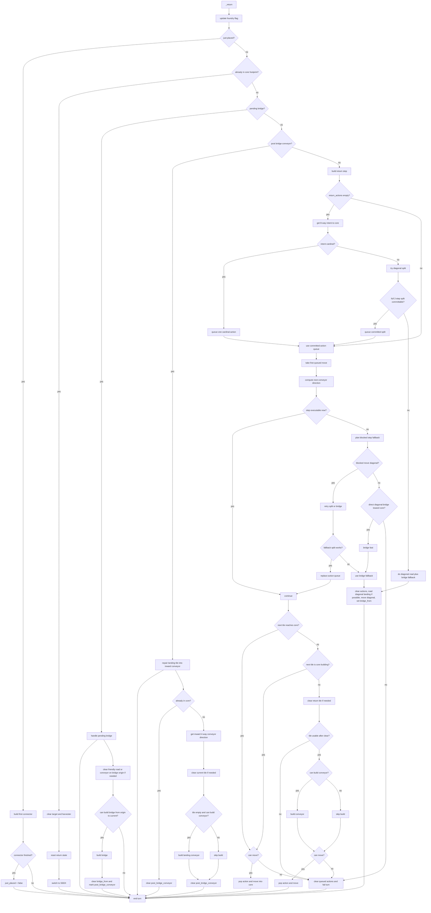

# Return Flow

This diagram reflects the current return-to-core flow in:

- `bots/v10/builders/harvester_revamped.py`
- `bots/v10/utils/harvester_states/return_to_core.py`

## Key Rules

- Return uses 8-way intent, but actual transport is committed as cardinal actions.
- A diagonal split is only allowed if both cardinal components are committable up front.
- If a diagonal cannot be safely split, it falls back to diagonal move plus next-turn bridge.
- If a committed step is blocked, return prefers a bridge-oriented fallback instead of broad rerouting.
- After a bridge is built, the landing tile is repaired into an inward conveyor before normal return continues.
